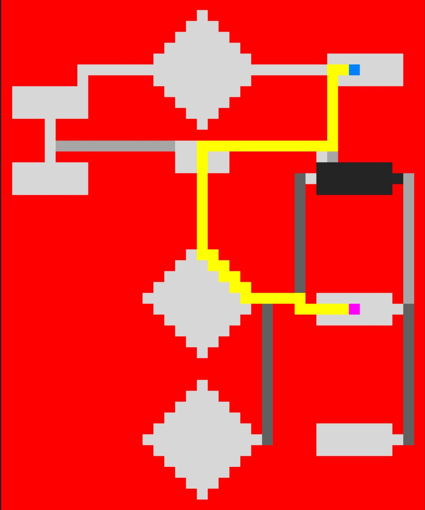

# A* search algorithm in Studentersamfundet


A* algorithm for finding the shortest path between rooms in Studentersamfundet in Trondheim :slightly_smiling_face:

This code is written as an assignment for the course __TDT4136 - Introduction to Artificial Intelligence__ :school:

## How to run
```sh
git clone https://github.com/dilawarm/samfundet.git
cd samfundet
pip3 install -r requirements.txt
python3 astar.py tasknumber
```
`tasknumber` is a number between 1 and 5 (inclusive).

Enjoy! :rocket:
